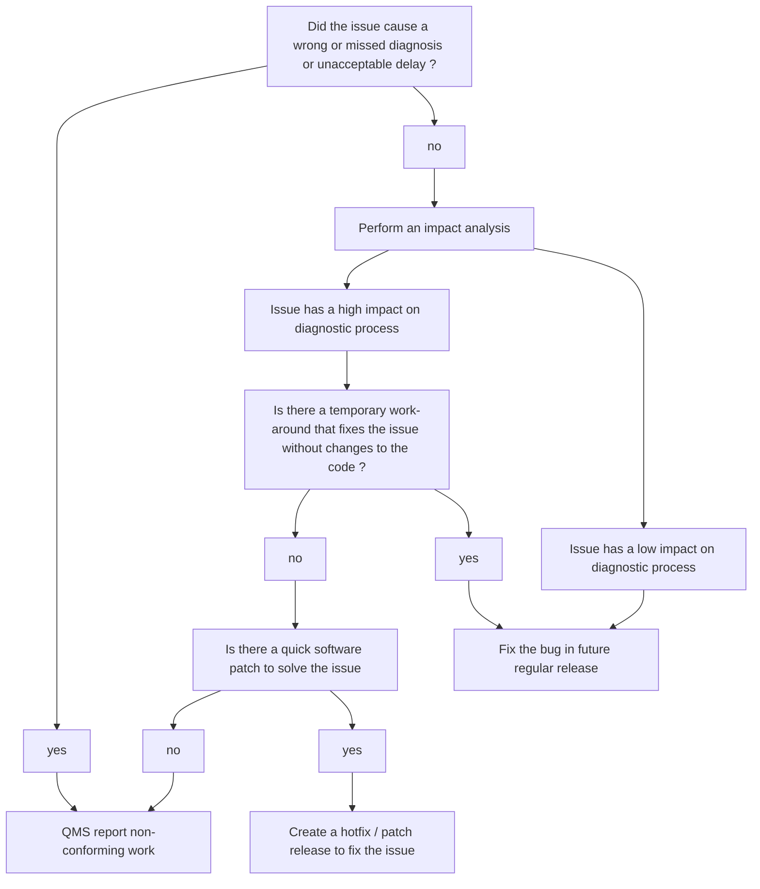

# Laboratory patients, user, and personnel feedback

Bioinformaticians develop data analysis workflows, tools and (web) applications that are used by different groups of end users. These end users will experience events where unexpected, incorrect or occasionally no results are produced, due to bugs. These bugs are caused by either errors, flaws or faults in the design, development, or operation of the software developed by the bioinformaticians. In addition, end users may come up with requests and suggestions for new features / functionality to further improve or expand the scope of existing software.

We make a distinction to general feedback regarding user requests and issues that relate to the use of Bioinformatics software as described in this paragraph and more serious issues that have lead for instance to missed or wrong diagnoses or to delays that cause diagnostic results and reports to either contain serious errors or exceed the deadline. For guidelines on how to handle latter issues we refer to the paragraph on non-conforming work.

The Bioinformaticians should have a user feedback process through which both reports of issues / bugs and requests can be submitted, recorded and processed. When the issues have been handled and actions have been taken, results need to be communicated back to the end users.

The user feedback process shall ensure that:

-   Feedback and/or requests from end users can be submitted and recorded.
-   Actions that are being taken to process the feedback / requests are recorded and communicated back to the users.

Examples of systems that may be used (together) to collect and record feedback and requests that can be configured to meet the stated goals are

-   A special purpose (non-personal) email address
-   A ticketing system
-   A web / service portal where issues / requests can be submitted by filling out forms
-   Lab meetings where feature requests are discussed and minutes are recorded
-   Built-in issue trackers of (Git) version control systems such as GitHub or GitLab
-   Work management / Task planner systems such as JIRA, Microsoft Teams Planner
-   Azure DevOps services

### non-conforming work

Laboratories should have a procedure in place to handle non-conforming work. Whether bugs or issues with Bioinformatics software need to be handled as non-conforming work will depend on the magnitude, impact and the occurrence (or probability / frequency of recurrence) of the issue in the diagnostic process. The following flow-chart will help to evaluate the severity of the issue in terms of these three criteria and gives guidance on the best course of action in handling the issue

