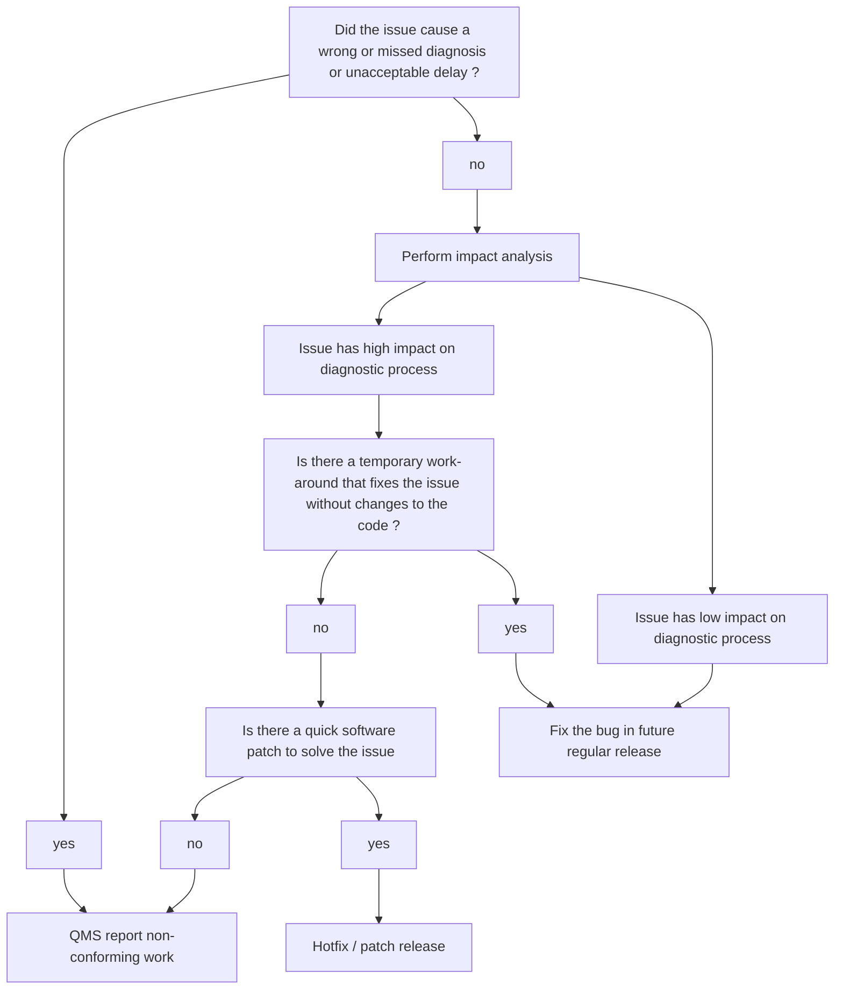

```mermaid
graph TD;
    A[Did the issue cause a wrong or missed diagnosis or unacceptable delay ?]-->B[yes];
    A-->D[no];
    D-->X[Perform impact analysis]
    X-->Y[Issue has high impact on diagnostic process]
    X-->Z[Issue has low impact on diagnostic process]
    Z-->G
    Y-->C[Is there a temporary work-around that fixes the issue without changes to the code ? ];
    B-->E[QMS report non-conforming work];
    M-->F[Hotfix / patch release];
    C-->I[no];
    C-->J[yes];
    J-->G[Fix the bug in future regular release];
    I-->K[Is there a quick software patch to solve the issue]
    K-->L[no]
    K-->M[yes]
    L-->E

```