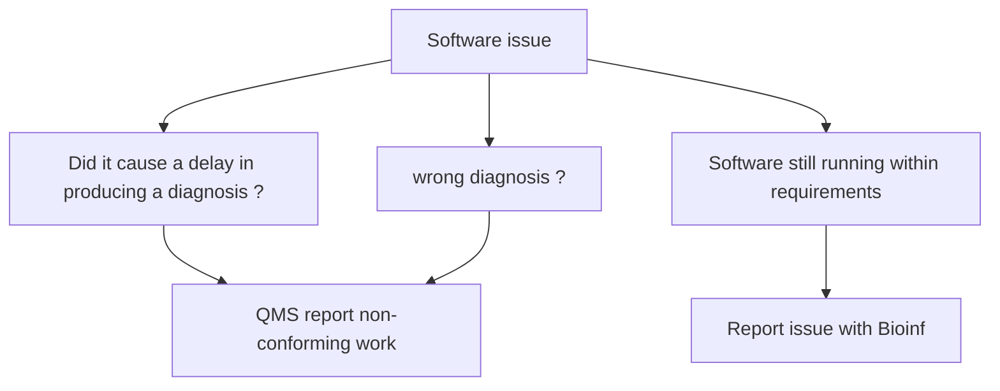

# Laboratory patients, user, and personnel feedback

Bioinformaticians develop data analysis workflows, tools and (web) applications that are used by different groups of laboratory analists and specialists, from hereafter refered as 'end users'. These end users will experience events where unexpected, incorrect or occasionally no results are produced, due to bugs which are caused by either errors, flaws or faults in the design, development, or operation of the software developed by the bioinformaticians. In addition, end users may come up with requests and suggestions for new features / functionality to further improve or expand the scope of existing software. 

The Bioinformatics Team therefore should have a system through which both reports of issues / bugs and requests can be submitted, traced and processed. Rather than using a single procedure / system to handle both issues and new requests or feedback, different procedures may be set up to process and handle them independently in a different way. When the issues have been handled and actions have been taken, results need to be communicated back to the end users. 

The requirements of the system are :

-   Feedback and/or requests from end users can be submitted to and registered by the system. 
-   Records of feedback shall be maintained including the actions taken. Communication shall be provided to personnel on actions taken arising from their feedback.

Examples of systems that may be used (together) to collect and register feedback and requests that can be configured to meet the stated requirements are

- A special purpose (non-Personal) email address 
- A ticketing system 
- A web / service portal where issues / requests can be submitted by filling out forms
- Lab meetings where feature requests are discussed and minutes are recorded
- Built-in issue trackers of (git) version control systems such as GitHub or GitLab
- Work management / Task planner systems such as JIRA, Microsoft Teams Planner
- Azure DevOps services

We make a distinction to general feedback and issues / requests that relate to the use of Bioinformatics software as described in this section and more serious issues that have lead for instance to missed or wrong diagnoses or to delays that cause diagnostic results and reports to exceed the deadline. For these we refer to the section on non-conforming work. Both 

### non-conforming work

