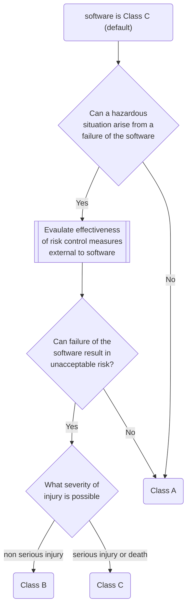

# Introduction

In the past years bioinformatics has become a crucial part of several medical laboratories, such as Genetics, Pathology and Medical Microbiology. In the Netherlands these laboratories are accredited according to ISO-15189 and have to follow European and national laws. Hence, bioinformaticians need to comply to both the ISO-15189, the IVDR and the GDPR.

The ISO-15189 does not include specific requirements for bioinformatic or software development processes.
The IEC-62304, however, is a harmonized standard about "Medical device software – Software life cycle processes" and can be used, as it complements the general requirements as described in ISO-15189 [^1].
Whilst the use of this standard remains voluntary, it nonetheless gives good guidance on how to achieve compliance with legal requirements.

We therefore used the IEC-62304 as a guide to create a field standard for bioinformatics, in order to make sure that the software we create is developed and manufactured in accordance with state-of-the-art principles for development life cycles, and risk management, including verification and validation, as required by the IVDR (Annex I, point 16). Note however, that we only focussed on the documentation needed for IEC-62304 Software Class A.

The main goal of this document is to give guidance on what should be documented to comply to the ISO-15189 norm and the IVDR. We tried to make pragmatic choices, and provide clarity on what should be documented.

While we were writing this field standard, it became clear to us that the size of bioinformatics teams varies. As a consequence, in particular when there is only a single bioinformatician working for the medical laboratory, some of the items described in this field standard will be rather difficult to incorporate. While this field standard does describe the need to comply to the IVDR and the ISO-15189, it might be impossible to comply to this field standard due to the lack of personnel. Make sure choices in such cases are well motivated and documented, and remember to revise these choices once the team has expanded.

## In scope

-   Bioinformatic workflows that generate results that are checked and interpreted under the supervision of trained clinical laboratory specialists.
-   Bioinformatic workflows that are in-house IVDs for which only article 5.5 of the IVDR applies.

## Out of scope

-   Bioinformatic workflows for which the results are used within health care institutions without interpretation by trained clinical laboratory specialists. For these workflows more documentation is needed, as they are most likely Class B or C in the IEC-62304. The same holds for workflows that include AI.
-   Personnel (6.2 in ISO-15189:2022), as this should be covered by QMS of the medical Laboratory already.
-   Datamanagement and retention periods of data are mentioned in another field standard [^2].

## Software Safety Classication according to the IEC-62304 [^3]

The SOFTWARE SYSTEM is software safety class A if:

- The SOFTWARE SYSTEM cannot contribute to a HAZARDOUS SITUATION; or
- The SOFTWARE SYSTEM can contribute to a HAZARDOUS SITUATION which does not result in unacceptable RISK after consideration of RISK CONTROL measures external to the SOFTWARE SYSTEM.

The SOFTWARE SYSTEM is software safety class B if:

- The SOFTWARE SYSTEM can contribute to a HAZARDOUS SITUATION which results in unacceptable RISK after consideration of RISK CONTROL measures external to the SOFTWARE SYSTEM and the resulting possible HARM is non-SERIOUS INJURY.

The SOFTWARE SYSTEM is software safety class C if:

- The SOFTWARE SYSTEM can contribute to a HAZARDOUS SITUATION which results in unacceptable RISK after consideration of RISK CONTROL measures external to the SOFTWARE SYSTEM and the resulting possible HARM is death or SERIOUS INJURY.

Flowdiagram adapted from IEC-62304, Figure 3 – Assigning software safety classification.

In determining the software safety classification of the SOFTWARE SYSTEM:

- Probability of a software failure shall be assured to be 1.
- Only RISK CONTROL measures not implemented within (External to) the SOFTWARE SYTEM shall be considered.

!!!note ""

     Such RISK CONTROL measures may reduce the probability that a software failure will cause HARM, and/or the severity of that HARM.      

[^1]: van Deutekom HWM, Haitjema S. Recommendations for IVDR compliant in-house software development in clinical practice: a how-to paper with three use cases. Clin Chem Lab Med. 2022. PMID: [35538674](https://www.degruyter.com/document/doi/10.1515/cclm-2022-0278/html).
[^2]: [Veldnorm VKGL](https://www.vkgl.nl/nl/kwaliteit/formulieren-documenten-kwaliteit/7-veldnormen).
[^3]: IEC-62304: Medical device software – software life cycle processes
